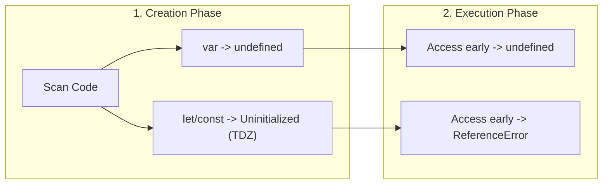
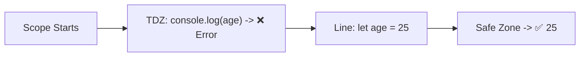

Variables are **containers that store data** in your program. JavaScript gives you three ways to declare them — `var`, `let`, and `const` — and knowing the difference is **critical for interviews**.

## The Three Keywords

### `const` — Your Default Choice

```javascript
const API_URL = "https://api.example.com";
const user = { name: "Shiva", role: "admin" };

API_URL = "new-url"; // ❌ TypeError: Assignment to constant variable
user.name = "Alex";  // ✅ Works! The object reference didn't change
```

**Key insight**: `const` prevents **reassignment of the variable**, NOT mutation of the value. Objects and arrays declared with `const` can still be modified internally.

### `let` — When You Need to Reassign

```javascript
let score = 0;
score = 10;    // ✅ Fine
score = 100;   // ✅ Fine

let score = 5; // ❌ SyntaxError: Cannot redeclare
```

### `var` — The Legacy Way (Avoid)

```javascript
var count = 1;
var count = 2;  // ✅ No error — this is a problem!
count = 3;      // ✅ Fine
```

## The Comparison Table (Interview Must-Know)

| Feature | `var` | `let` | `const` |
|---------|-------|-------|---------|
| **Scope** | Function | Block | Block |
| **Hoisted?** | Yes (as `undefined`) | Yes (TDZ) | Yes (TDZ) |
| **Reassignable?** | Yes | Yes | No |
| **Redeclarable?** | Yes | No | No |
| **Added in** | ES1 (1997) | ES6 (2015) | ES6 (2015) |

## Scope — Where Can You Access a Variable?

### Function Scope (`var`)

`var` is scoped to the **nearest function**, not the nearest block.

```javascript
function example() {
  if (true) {
    var x = 10;
  }
  console.log(x); // 10 ← var leaked out of the if block!
}

example();
```

### Block Scope (`let` and `const`)

`let` and `const` are scoped to the **nearest `{ }`** block.

```javascript
function example() {
  if (true) {
    let x = 10;
    const y = 20;
  }
  console.log(x); // ❌ ReferenceError: x is not defined
  console.log(y); // ❌ ReferenceError: y is not defined
}
```

### Real-World Problem — Loop with `var`

This is one of the **most famous JavaScript interview questions**:

```javascript
// ❌ Bug: var is function-scoped
for (var i = 0; i < 3; i++) {
  setTimeout(() => console.log(i), 100);
}
// Output: 3, 3, 3 (NOT 0, 1, 2)
```

**Why?** `var i` is shared across all iterations. By the time the `setTimeout` callbacks run, the loop is done and `i` is already `3`.

```javascript
// ✅ Fix 1: var + IIFE (The Legacy Fix)
for (var i = 0; i < 3; i++) {
  (function(j) {
    setTimeout(() => console.log(j), 100);
  })(i);
}
// Output: 0, 1, 2
```

> **Quick Reference: IIFE**  
> An **IIFE** (Immediately Invoked Function Expression) is a function that runs the moment it is defined. By passing `i` into the IIFE as `j`, we create a new, separate function scope for each iteration, effectively "locking in" the current value.

```javascript
// ✅ Fix 2: let is block-scoped (The Modern Fix)
for (let i = 0; i < 3; i++) {
  setTimeout(() => console.log(i), 100);
}
// Output: 0, 1, 2
```

Each iteration gets its own copy of `i` because `let` creates a new binding per block.

## Hoisting — What Really Happens

Hoisting doesn't mean JavaScript physically cuts and moves your code to the top of the file. 

Instead, the JS engine executes code in **two distinct phases**:
1. **Creation Phase**: Scans the code, allocates memory for variables and functions.
2. **Execution Phase**: Runs your code line-by-line, assigning values and calling functions.



### `var` Hoisting

```javascript
console.log(name); // undefined (not an error!)
var name = "Shiva";
```

What the engine actually sees:

```javascript
var name;              // declaration hoisted & initialized to undefined
console.log(name);     // undefined
name = "Shiva";        // assignment stays here
```

### `let` / `const` Hoisting and the TDZ

```javascript
console.log(age); // ❌ ReferenceError: Cannot access 'age' before initialization
let age = 25;
```

`let` and `const` ARE hoisted, but they sit in a **Temporal Dead Zone (TDZ)** — the period from the start of the scope until the engine reaches the initialization line. Accessing a variable inside its TDZ throws a `ReferenceError`.



```javascript
// TDZ starts here for 'age'
// ... any access to 'age' here throws ReferenceError
let age = 25; // TDZ ends, 'age' is now accessible
```

## When to Use Which

```text
Default to `const`
  ↓
Need to reassign? Use `let`
  ↓
Never use `var` (unless maintaining legacy code)
```

### Real-World Examples

```javascript
// ✅ const for values that don't change
const MAX_RETRIES = 3;
const API_KEY = process.env.API_KEY;
const user = { name: "Shiva" }; // object ref won't change

// ✅ let for values that change
let currentPage = 1;
let isLoading = false;
let retryCount = 0;

// Loop counters
for (let i = 0; i < items.length; i++) {
  // i changes each iteration
}

// Accumulating results
let total = 0;
for (const price of prices) {
  total += price;
}
```

## Common Mistakes

### 1. Thinking `const` Makes Objects Immutable

```javascript
const config = { debug: false };
config.debug = true;      // ✅ Works — you're mutating, not reassigning
config = { debug: true };  // ❌ TypeError — this is reassignment
```

To truly make an object immutable:

```javascript
const config = Object.freeze({ debug: false });
config.debug = true; // Silently fails (or throws in strict mode)
```

### 2. Using `var` in Blocks

```javascript
if (true) {
  var leaked = "I'm accessible outside!";
}
console.log(leaked); // "I'm accessible outside!"
```

### 3. Not Understanding TDZ with `typeof`

```javascript
// With undeclared variables, typeof is safe
console.log(typeof undeclaredVar); // "undefined" — no error

// With let/const in TDZ, typeof STILL throws
console.log(typeof myLet); // ❌ ReferenceError
let myLet = 5;
```

## Interview Questions

### Q: What will this output?

```javascript
var a = 1;
let b = 2;

if (true) {
  var a = 10;
  let b = 20;
  console.log(a, b);
}

console.log(a, b);
```

**Answer**: `10 20` then `10 2`.

- `var a = 10` overwrites the outer `a` (function-scoped)
- `let b = 20` creates a NEW `b` inside the block (block-scoped)
- Outside the block, `a` is now `10` but `b` is still `2`

### Q: Is `const` really constant?

**Answer**: The **binding** (the variable name → value connection) is constant. For primitives, the value can't change. For objects/arrays, the reference can't change but the contents can.

