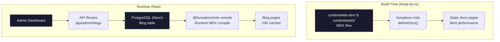
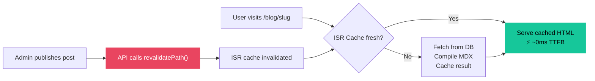

# Admin Dashboard Plan for Dev-Axioms

> [!IMPORTANT]
> **Goal**: Update blogs (and optionally docs) from an admin dashboard without rebuilding/redeploying, while preserving Fumadocs performance.

---

## Current Architecture

| Content | Source | How it works |
|---------|--------|-------------|
| **Docs** (web-dev, web3) | `content/web-dev/`, `content/web3/` MDX files | `fumadocs-mdx` build-time compilation → `defineDocs()` |
| **Blogs** | `content/blogs/` MDX files | `fumadocs-mdx` build-time compilation → `defineCollections()` |

**Problem**: Every content change requires a git push → rebuild → redeploy. No dashboard, no live editing.

---

## Recommended Strategy: **Hybrid Content Architecture**



### Why This Split?

| Content Type | Strategy | Reasoning |
|-------------|----------|-----------|
| **Docs** (web-dev, web3) | **Keep static (fumadocs-mdx)** | Docs are structural, rarely change, benefit from build-time TOC/search indexing. Imports/components work. Best perf. |
| **Blogs** | **Move to DB + runtime MDX** | Blogs change frequently, are simpler MDX (no imports), benefit most from a dashboard workflow. |

> [!TIP]
> You already have `@fumadocs/mdx-remote` installed! And you have Prisma + Neon DB set up. This plan leverages your existing stack.

---

## Phase 1: Database Schema

Add a `BlogPost` model to your Prisma schema:

```prisma
model BlogPost {
  id          String   @id @default(dbgenerated("gen_random_uuid()")) @db.Uuid
  title       String
  slug        String   @unique
  description String?
  content     String   // Raw MDX string
  author      String
  date        DateTime @default(now())
  published   Boolean  @default(false)
  tags        String[] @default([])
  createdAt   DateTime @default(now()) @map("created_at") @db.Timestamp(6)
  updatedAt   DateTime @default(now()) @updatedAt @map("updated_at") @db.Timestamp(6)

  @@map("blog_post")
}
```

> [!NOTE]
> The `content` field stores **raw MDX** (markdown + JSX). No compilation happens at write-time — only at read-time via `@fumadocs/mdx-remote`.

---

## Phase 2: API Routes for CRUD

Create API routes under `app/api/admin/blogs/`:

```
app/api/admin/blogs/
├── route.ts          # GET (list all), POST (create)
├── [id]/
│   └── route.ts      # GET (single), PUT (update), DELETE
└── publish/
    └── route.ts      # POST — toggle publish + trigger revalidation
```

### Key behaviors:
- **Auth-gated**: Check `role === "ADMIN"` from better-auth session
- **On publish/update**: Call `revalidatePath('/blog', 'layout')` to purge ISR cache
- **Slug auto-generation**: From title, with uniqueness check

---

## Phase 3: Runtime MDX Rendering (Blog Pages)

Replace the current static blog loader with a DB-backed one:

### New `lib/source.ts` (blog section only)

```typescript
// Keep docs loaders untouched (webdev, web3)
// Replace blog loader:

import { createCompiler } from '@fumadocs/mdx-remote';
import { prisma } from '@/db/prisma';

const compiler = createCompiler();

export async function getBlogPosts() {
  return prisma.blogPost.findMany({
    where: { published: true },
    orderBy: { date: 'desc' },
    select: { title: true, slug: true, description: true, author: true, date: true, tags: true },
  });
}

export async function getBlogPost(slug: string) {
  const post = await prisma.blogPost.findUnique({ where: { slug } });
  if (!post || !post.published) return null;

  const compiled = await compiler.compile(post.content);
  return { ...post, compiled };
}
```

### Updated blog `[slug]/page.tsx`

```tsx
import { getBlogPost, getBlogPosts } from '@/lib/blog-source';
import { getMDXComponents } from '@/mdx-components';

export const revalidate = 3600; // ISR: revalidate every hour
// OR use on-demand revalidation (better)

export default async function Page({ params }: { params: Promise<{ slug: string }> }) {
  const { slug } = await params;
  const post = await getBlogPost(slug);
  if (!post) notFound();

  const { compiled } = post;
  return (
    <article>
      <compiled.body components={getMDXComponents()} />
    </article>
  );
}

export async function generateStaticParams() {
  const posts = await getBlogPosts();
  return posts.map(p => ({ slug: p.slug }));
}
```

> [!IMPORTANT]
> **`@fumadocs/mdx-remote` limitations**: No `import`/`export` in MDX. Custom components must be passed via the `components` prop. Images can't use Next.js `<Image>` optimization automatically — use regular `` or handle via components map.

---

## Phase 4: Admin Dashboard

You already have `app/admin/` — expand it:

```
app/admin/
├── layout.tsx           # Admin layout with auth guard (ADMIN role check)
├── page.tsx             # Dashboard overview
├── blogs/
│   ├── page.tsx         # Blog list (drafts + published)
│   ├── new/
│   │   └── page.tsx     # New blog form with MDX editor
│   └── [id]/
│       └── page.tsx     # Edit blog form
└── components/
    ├── mdx-editor.tsx   # MDX editor (you already have @mdxeditor/editor!)
    └── blog-form.tsx    # Shared form component
```

### Editor Stack (already installed!)

You have `@mdxeditor/editor` in your deps — this is perfect for a rich MDX editor with:
- Live preview
- Toolbar (bold, italic, headings, code blocks, links)
- Source mode for raw MDX editing

### Editor Component Sketch

```tsx
'use client';
import { MDXEditor, headingsPlugin, listsPlugin, quotePlugin, 
         markdownShortcutPlugin, codeBlockPlugin, linkPlugin,
         toolbarPlugin, BoldItalicUnderlineToggles, BlockTypeSelect,
         CreateLink, InsertCodeBlock } from '@mdxeditor/editor';

export function BlogEditor({ content, onChange }: { content: string; onChange: (val: string) => void }) {
  return (
    <MDXEditor
      markdown={content}
      onChange={onChange}
      plugins={[
        headingsPlugin(),
        listsPlugin(),
        quotePlugin(),
        codeBlockPlugin(),
        linkPlugin(),
        markdownShortcutPlugin(),
        toolbarPlugin({
          toolbarContents: () => (
            <>
              <BoldItalicUnderlineToggles />
              <BlockTypeSelect />
              <CreateLink />
              <InsertCodeBlock />
            </>
          ),
        }),
      ]}
    />
  );
}
```

---

## Phase 5: Caching & Performance Strategy



### Strategy Options (pick one):

| Strategy | How | Latency | Freshness |
|----------|-----|---------|-----------|
| **A: On-demand revalidation** ✅ Recommended | Admin API calls `revalidatePath('/blog')` on save/publish | ~0ms (cached) | Instant after admin action |
| **B: Time-based ISR** | `export const revalidate = 3600` | ~0ms (cached) | Up to 1hr stale |
| **C: Full dynamic** | `export const dynamic = 'force-dynamic'` | ~200-500ms | Always fresh |

> [!TIP]
> **Go with Option A**. You get static-like performance (served from cache) with instant updates when you publish from the dashboard. Best of both worlds.

---

## Phase 6: Search Integration

Your current search likely uses Fumadocs' built-in search index (generated at build time). For DB-backed blogs:

**Option 1: Rebuild search index on content change**
- After admin saves, hit an API endpoint that regenerates the search index
- Use Fumadocs' `createSearchAPI` with a custom data source that includes DB blogs

**Option 2: Separate blog search**
- Add a simple `/api/search/blogs` endpoint that does `WHERE title ILIKE '%query%' OR description ILIKE '%query%'`
- Merge results client-side with doc search

**Option 3 (Scalable): Full-text search with Postgres**
```sql
ALTER TABLE blog_post ADD COLUMN search_vector tsvector
  GENERATED ALWAYS AS (
    to_tsvector('english', coalesce(title, '') || ' ' || coalesce(description, '') || ' ' || coalesce(content, ''))
  ) STORED;

CREATE INDEX blog_post_search_idx ON blog_post USING GIN(search_vector);
```

---

## Migration Plan (Existing Blogs → DB)

To move your 4 existing blog posts from `content/blogs/` to the database:

1. Write a one-time migration script that:
   - Reads each `.mdx` file from `content/blogs/`
   - Extracts frontmatter (title, description, author, date)
   - Inserts into `BlogPost` table
2. Update `lib/source.ts` to use DB-backed blog loader
3. Remove `blog` collection from `source.config.ts`
4. Keep `content/blogs/` as archive (or delete)

---

## Summary: What Changes vs. What Stays

| Component | Change? | Details |
|-----------|---------|---------|
| `source.config.ts` | ✏️ Minor | Remove `blog` collection definition |
| `lib/source.ts` | ✏️ Modify | Keep docs loaders, replace blog loader with DB-backed |
| `prisma/schema.prisma` | ✏️ Add | New `BlogPost` model |
| `app/api/admin/blogs/` | 🆕 New | CRUD API routes |
| `app/admin/blogs/` | 🆕 New | Admin dashboard pages |
| `app/(home)/blog/` | ✏️ Modify | Use DB + `@fumadocs/mdx-remote` instead of static loader |
| `next.config.mjs` | ❌ No change | `withMDX` still needed for docs |
| Docs pages | ❌ No change | Stay fully static, best performance |
| `@fumadocs/mdx-remote` | ✅ Already installed | Used for runtime blog MDX compilation |
| `@mdxeditor/editor` | ✅ Already installed | Used for admin MDX editor |

---

## Implementation Order

```
1. Schema      → Add BlogPost to Prisma, run migration
2. API Routes  → CRUD endpoints with auth
3. Blog Source → New DB-backed loader + mdx-remote rendering  
4. Admin UI    → Blog list, create/edit forms with MDX editor
5. Cache       → On-demand revalidation from admin API
6. Migration   → Move existing 4 blog posts to DB
7. Search      → Integrate DB blogs into search
```

> [!CAUTION]
> **Don't try to move docs to DB**. Docs benefit enormously from build-time processing: import support, component embedding, auto-generated TOC, sidebar navigation trees, and Fumadocs' search indexing. The perf and DX tradeoff isn't worth it for docs that change infrequently.
